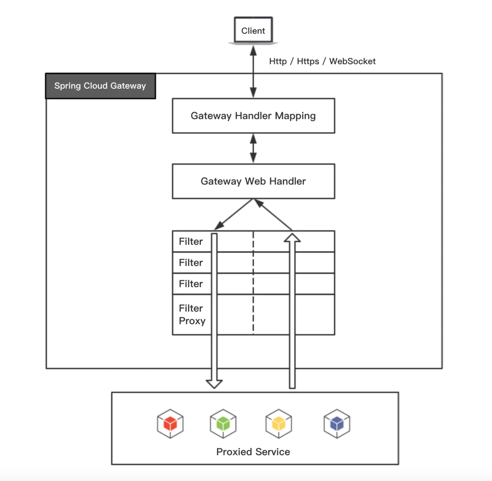

This article records my first attempt with mircro-service using **Netflix Eureka** as service register and discovery center, and **Spring cloud Gateway** as the API gateway.

P.S. It's so dumb that our instructor asked us to use Zuul as the gateway component, which has been deprecated since Spring Boot 2.

## 1. Service discovery

A distributed system typically comprises a large number of services which communicate with each other to perform certain operations. Service discovery is the process of one service **dynamically discovering the network location (IP address and port) of another service to communicate with it**.

### 1.1. What is Eureka

Eureka is a REST based service which is primarily used for acquiring information about services that you would want to communicate with. This REST service is also known as Eureka Server. The Services that register in Eureka Server to obtain information about each other are called Eureka Clients.

The Eureka server knows all the client applications running on each port and IP address. When any of the Eureka clients want to communicate with another client, it can obtain the target IP address and the port via Eureka server.

### 1.2. Setting up Eureka in Spring Boot

#### 1.2.1. Server

```properties
# Server port should be the same as service zone.
server.port=8040

spring.application.name=eureka-server

eureka.instance.prefer-ip-address=true
# No need to register the server itself.
eureka.client.register-with-eureka=false
eureka.client.fetch-registry=false
eureka.client.service-url.defaultZone=http://localhost:8040/eureka
```

### 1.2.2. Microservice as Client

```properties
spring.application.name=...

# Setting prefer-ip-address to false will register instance with hostname.
eureka.instance.prefer-ip-address=true
eureka.client.register-with-eureka=true
eureka.client.fetch-registry=true
eureka.client.service-url.defaultZone=http://localhost:8040/eureka
```

## 2. Spring Cloud Gateway

### 2.1. How Gateway works



As the images shows, when the gateway client sends a request to the gateway, the Gateway Handler Mapping decides if the url hits any of the patterns, and Gateway Handler takes care of the actual forwarding. The request then goes through a bunch of pre-filters, gets processed by the proxied service, and goes back through a bunch of post-filters.

### 2.2. Some pitfalls in implementation

#### Use service discovery to avoid hard-coded service url

With service discovery set up, we can just use service name to tell the gateway where to forward the request.

```java
@Bean
public RouteLocator routeLocator(RouteLocatorBuilder builder) {
    return builder.routes()
                      .route(<route-id>, r -> r.path(<pattern>)
                      .uri("lb://<service-name>"))
                  .build();
}
```

#### URL strip prefix

In the scenario of Spring Cloud Gateway, the URI is forwarded **in its entirety** by default. This means the service name, which is normally intended only for identification of service, will also be included in the forwarded URI. To strip the service name, in java code we can add:

```java
@Bean
public RouteLocator routeLocator(RouteLocatorBuilder builder) {
    return builder.routes()
                      .route(<route-id>, r -> r.path(<pattern>)
                      .filters(f -> f.stripPrefix(1))
                      .uri("lb://<service-name>"))
                  .build();
}
```

The parameter in `stripPrefix` indicates how many back slash separated segments of uri should be removed.

#### Deduplicate CORS headers

If both the gateway and the servie has added CORS headers to the response, then the error

> The 'Access-Control-Allow-Origin' header contains multiple values '...', but only one is allowed.

will be reported. This means we should only retain one set of CORS headers in the response by deduplication:

```java
@Bean
public RouteLocator routeLocator(RouteLocatorBuilder builder) {
    return builder.routes()
                      .route(<route-id>, r -> r.path(<pattern>)
                      .filters(f -> f.stripPrefix(1)
                          .dedupeResponseHeader("Access-Control-Allow-Credentials", "RETAIN_FIRST")
                          .dedupeResponseHeader("Access-Control-Allow-Origin", "RETAIN_FIRST")))
                      .uri("lb://<service-name>"))
                  .build();
}
```
